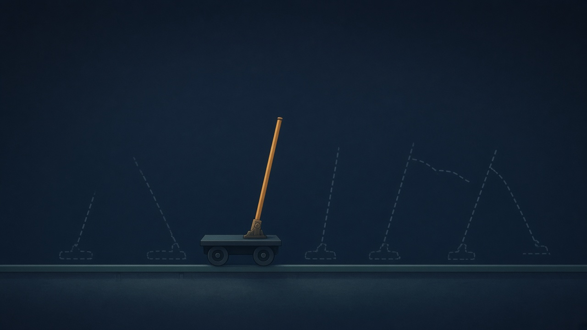

**License notice**
This project is **source-available** under the **[PolyForm Noncommercial License 1.0.0](LICENSE.md)** — free for personal, research, teaching, and internal-evaluation use.

**Any commercial use, redistribution as part of a commercial product, or paid hosted deployment requires a separate commercial license.** See [`COMMERCIAL.md`](COMMERCIAL.md) or contact `https://github.com/AnubhabBanerjee`.

Unauthorized commercial use or redistribution is a violation of the license terms.

---

Read the full deep-dive here: https://towardsdatascience.com/how-to-make-your-first-world-model-from-scratch/

---




---

# Building a Minimal World Model from Scratch

A neural network that learns to *be* the CartPole environment. Once trained, it
can be cut off from the simulator entirely and asked to imagine the future from
nothing but a starting state and a sequence of actions.

This is the companion repo for a beginner tutorial. The world model itself is
under 100 lines and trains in a couple of minutes on a GPU. The full pipeline,
including the DQN baselines and the 100-episode evaluations, takes about an
hour — most of it spent retraining DQNs so the comparison is honest.

## The twist

The model never sees the cart's velocity or the pole's angular velocity — only
cart position and pole angle. It has to infer motion from history, which is what
gives the GRU's memory something real to do.

## The point

A DQN trained on CartPole solves it, and we don't pretend otherwise. What it
can't do is take a new instruction. Ask it to balance the pole *and* park the
cart at x = +1.0 and it has to be retrained from scratch, because its goal is
baked into its weights.

The world model just gets a different scoring function. Same weights, no new
data, no training — because it learned the *physics*, not the task.

## Quickstart

Requires **Python 3.10+**.

```bash
pip install -r requirements.txt

python collect_data.py   # roll out CartPole, save the offline dataset
python train.py          # train the world model
python imagine.py        # roll it forward without the simulator, measure the drift
python goals.py          # sanity-check the scoring functions, draw their preferences
python plan.py           # play CartPole by dreaming futures and picking the best
python baseline.py       # train the DQNs and draw the comparisons
```

**Run them in that order.** Each one reads what the previous wrote:
`plan.py` needs the horizon measured by `imagine.py`, and `baseline.py` reads
`plan.py`'s results and traces to compare against. Running `baseline.py` early
will fail on a missing `checkpoints/plan_results.json`.

Each script runs with no arguments. Settings live as constants at the top of
each file.

## Layout

| File | What it does |
| --- | --- |
| `collect_data.py` | Generates trajectories under a mixed policy |
| `model.py` | The GRU world model and its two prediction heads |
| `train.py` | Training loop, backpropagation through time |
| `imagine.py` | Autoregressive rollouts, and how far they can be trusted |
| `goals.py` | Scoring functions — what counts as a good imagined future |
| `plan.py` | Acts in the real environment by dreaming and comparing futures |
| `baseline.py` | A minimal DQN to compare against |

## Where the numbers come from

Every figure in the article is produced by one of these scripts, and every
number it quotes is written to `checkpoints/` so it can be checked without a
rerun:

| File | Written by | Holds |
| --- | --- | --- |
| `data_stats.json` | `collect_data.py` | Dataset size, episode lengths, how runs ended |
| `train_metrics.json` | `train.py` | One-step error, termination recall, parameter count |
| `horizon.json` | `imagine.py` | The measured horizon H, the drift table, fall-time error |
| `plan_results.json` | `plan.py` | Per-goal planner scores, latencies, the horizon sweep |
| `plan_traces.npz` | `plan.py` | Cart position traces for every evaluation episode |
| `baseline_results.json` | `baseline.py` | DQN scores per goal, retraining costs, per-run fates |

Re-running the pipeline overwrites those JSON files. Git will show them as
modified even when the numbers match. That is expected — the committed copies
are the article's numbers, and a reproduction run does not need to be committed.

`project_plan.md` holds the design rationale, plus a record of the decisions
that changed while building it and why.

